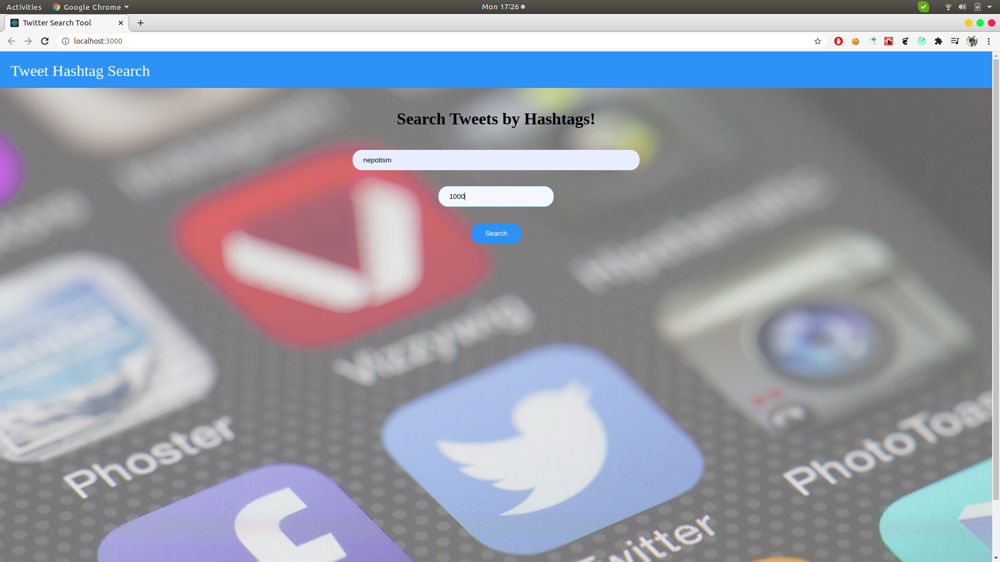
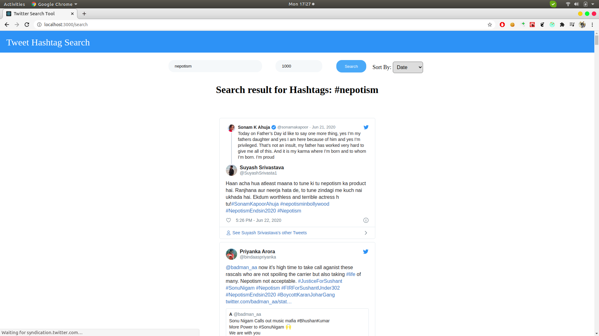

# react-redux-express-twitter web application

This [demo](https://hashtagsearcher.herokuapp.com/) works well in Google Chrome Version 67.0.3396.99.

TODO:
Solve the issue in other browsers for rendering Embedded Tweets.

## Screen Shots








## Technology

* [node](https://nodejs.org/en/)
* [npm](https://www.npmjs.com/) 
* [git](https://git-scm.com/)

## Development

Prepare for the config file for development.

```bash
cd config
touch server.config.development.js
cd ../
```

Add your development credientials in server.config.development.js file.

```javascript
module.exports = {
  twitterConfig: {
    consumer_key: "xxxxx",
    consumer_secret: "xxxxx",
    access_token_key: "xxxxx",
    access_token_secret: "xxxxx"
  }
};
```

Install server and client dependencies and run server and client concurrently.

```bash
npm install
npm run client-install
npm run dev
```

## Production

Build static production files.

```bash
cd client
npm run build
```


